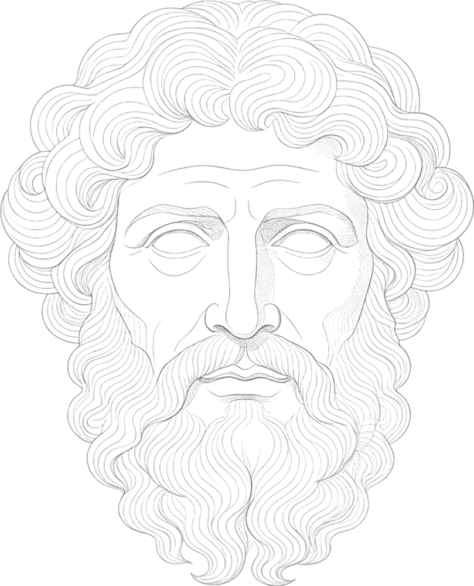
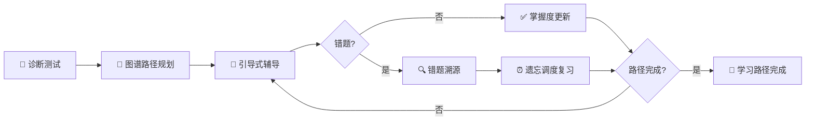
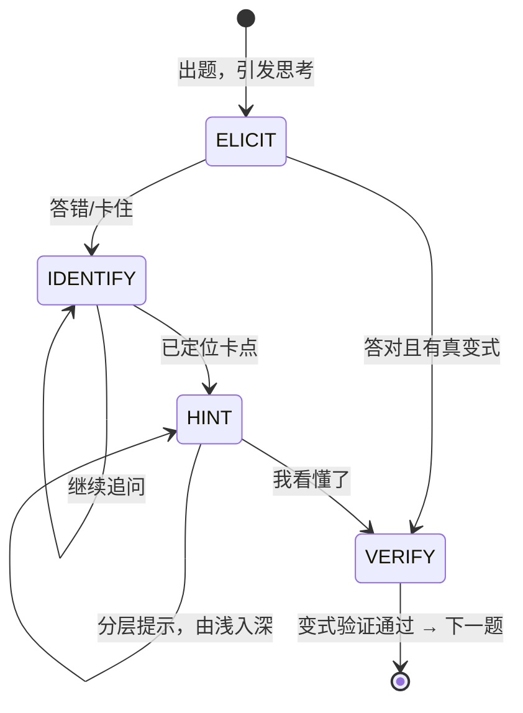
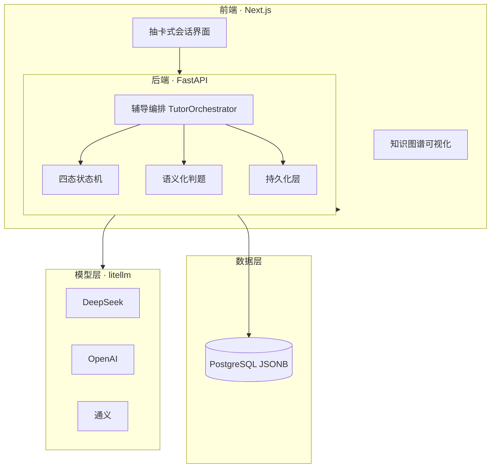

<div align="center">



# AdaptTutor

**通用自适应学习引擎 · 领域无关 · 苏格拉底式引导**

> "干净、安静，没有多余的元素；但有一束温暖的光，照在你正在思考的问题上。"
>
> —— 设计理念 · *a room for thinking*

[](https://nextjs.org/)
[](https://fastapi.tiangolo.com/)
[](https://www.typescriptlang.org/)
[](https://www.python.org/)
[](https://www.postgresql.org/)
[](https://www.docker.com/)
[](https://github.com/BerriAI/litellm)

**学习闭环：诊断 → 路径规划 → 引导辅导 → 错题溯源 → 遗忘调度复习**

</div>

---

## ✨ 它是什么

一个**领域无关**的自适应学习引擎。学科内容以「领域包」接入，引擎本身不绑定任何学科——今天可以是初中数学，明天可以是 LLM 应用开发。

它**不是**一个聊天机器人，而是一套完整的、可真实长期使用的学习系统：

- **不直接给答案**：苏格拉底式状态机引导你亲口说出解法
- **数据不丢**：会话、掌握度、错题全程持久化，随时恢复
- **效果可验证**：每个节点都有量化掌握度，学习路径清晰可回溯
- **出问题可修**：领域包是纯配置，改题不改引擎

## 🎯 核心能力

| | 能力 | 说明 |
|---|---|---|
| 🗺️ | **知识图谱路径规划** | 章节级图谱 + 应用层图算法，从薄弱点自动生成个性化学习路径 |
| 💬 | **四态引导状态机** | ELICIT → IDENTIFY → HINT → VERIFY，每一步都经过状态机裁决，杜绝"直接给答案" |
| 🃏 | **抽卡式卡片交互** | 题目卡正面作答、背面判题反馈，支持上一张/下一张翻看，像复习卡片一样自然 |
| ✅ | **语义化判题** | 规则层双向包含 + LLM 语义等价判断——"x=2" 与 "2"、省略铺垫只答结论，都算对 |
| 🔁 | **错题复习队列** | 答错自动进队，随机间隔重新出现；本轮结束提示"还有 N 道错题未巩固" |
| 📦 | **领域包机制** | 学科内容 = 图谱 + 题目 + 诊断规则，一个文件夹即一个学科 |

## 🔄 学习闭环



## 🧭 辅导状态机

每一道题都走一条**确定性、可测试、可回滚**的引导路径：



> 无真变式的题目（如无数字可偏移的辨析题）答对即通过，不再进入 VERIFY——**内容相同的伪变式永远不会出现**。

## 🛠️ 技术栈

| 层 | 选型 | 一句话理由 |
|---|---|---|
| 前端 | **Next.js 14 · TypeScript · TailwindCSS** | 抽卡式交互 + 双主题（墨蓝/琥珀），`@xyflow/react` 渲染知识图谱 |
| 后端 | **FastAPI · SQLAlchemy(async) · Alembic** | 单机无分布式诉求，后台任务队列即可承载 |
| 存储 | **PostgreSQL JSONB** | 章节级图谱无需图数据库，JSONB 存图 + 应用层图算法 |
| 模型 | **litellm 多模型路由** | 一次接入 DeepSeek / OpenAI / 通义……按任务分层路由，降级可控 |
| 部署 | **Docker Compose** | `docker compose up` 一条命令起全套 |

> 关键取舍：弃 Neo4j（JVM 常驻 3-5GB）、弃 Qdrant（数百题规模标签过滤足矣）、弃 Celery+Redis（无分布式诉求）、弃 LangGraph（自研状态机更可控）。详见 [docs/01-技术栈选型对比.md](docs/01-技术栈选型对比.md)。

## 🚀 快速开始

```bash
# 1. 克隆
git clone https://github.com/echo804/AdaptTutor.git && cd AdaptTutor

# 2. 一键启动（Docker Compose：Postgres + API + Web）
docker compose -f docker-compose.local.yml up -d

# 3. 打开浏览器
# 前端  http://localhost:3000
# 后端  http://localhost:8010/docs

# 开发模式（热更新）
./dev.ps1
```

配置模型密钥后即可开始第一次学习：注册账号 → 选择领域包 → 做诊断测试 → 进入引导式辅导。

## 📦 内置领域包

| 领域包 | 说明 | 规模 |
|---|---|---|
| `llm_app_dev` | LLM 应用开发工程课（RAG / Agent / 微调 / 推理） | 171 题 · 四档难度 |
| `junior_math_eq_ineq` | 初中数学·方程与不等式 | 多题型 · 参数化变式 |
| `ud153_*` | 用户上传领域示例（AI 生成 → 审阅 → 入库全流程） | 自定义 |

> **想学什么就接入什么**：一个 `knowledge_graph.json` + 一个 `questions.json` + 诊断规则，就是一个新学科。支持 AI 批量生成后人工审阅。

## 📐 架构总览



## 📚 文档

| 文档 | 内容 |
|---|---|
| [00-环境搭建](docs/00-环境搭建.md) | 本机实测基线 · 配置与密钥管理 |
| [01-技术栈选型对比](docs/01-技术栈选型对比.md) | 8 项核心选型的对比与弃用理由 |
| [02-项目计划](docs/02-项目计划.md) | 范围分层 · 里程碑 · 量化硬指标 |
| [03-项目架构](docs/03-项目架构.md) | 系统架构 · 引擎与领域包边界 · API 设计 |
| [04-需求决策记录](docs/04-需求决策记录.md) | 登录/题型/降级/产品形态等全部决策 |
| [05-UI设计规范](docs/05-UI设计规范.md) | 「思考的房间」· 配色/字体/动效/情感化细节 |
| [ADR-001~006](docs/) | 状态机选型 · 图谱存储 · 模型分层路由 · 评估层 · 回滚策略 · 领域包接口 |

## 🎨 设计哲学

> **色彩的唯一作用是指引注意力**——只有当前追问、正在查看的知识节点、需要你点击的交互元素，才使用强调色；其余一切保持中性。
>
> **动效只用于两种目的**——引导注意力，或解释信息变化；任何纯装饰性动效都是多余的。
>
> **界面为「长时间思考」服务**——字号、行高、对比度按护眼标准设计，不讨好眼球。

界面是一间安静的、有光的思考室——**墨蓝**是沉静，**琥珀**是那束照在问题上的光。

## 📄 License

MIT © 2026 AdaptTutor
