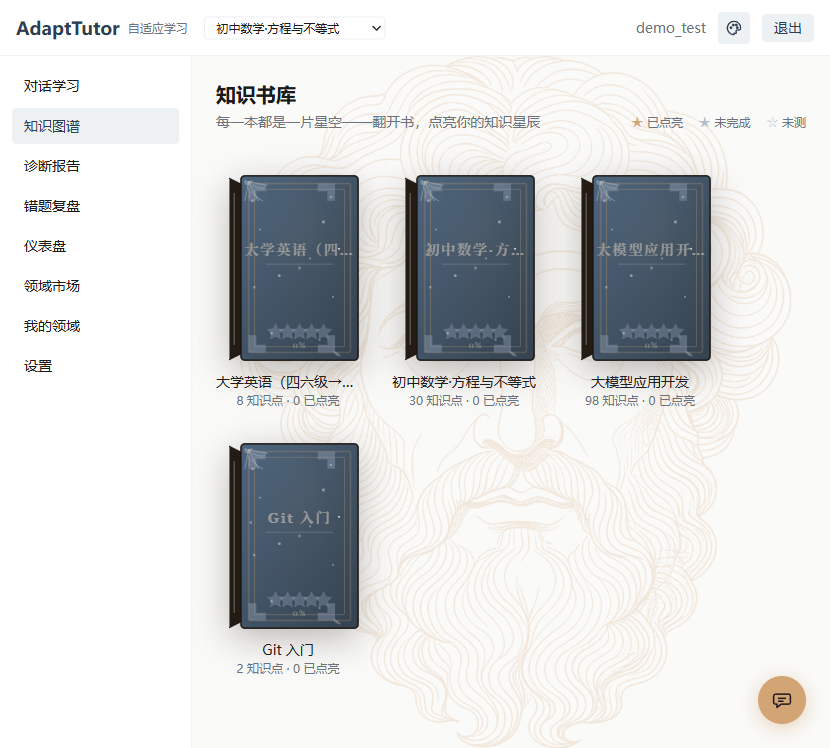
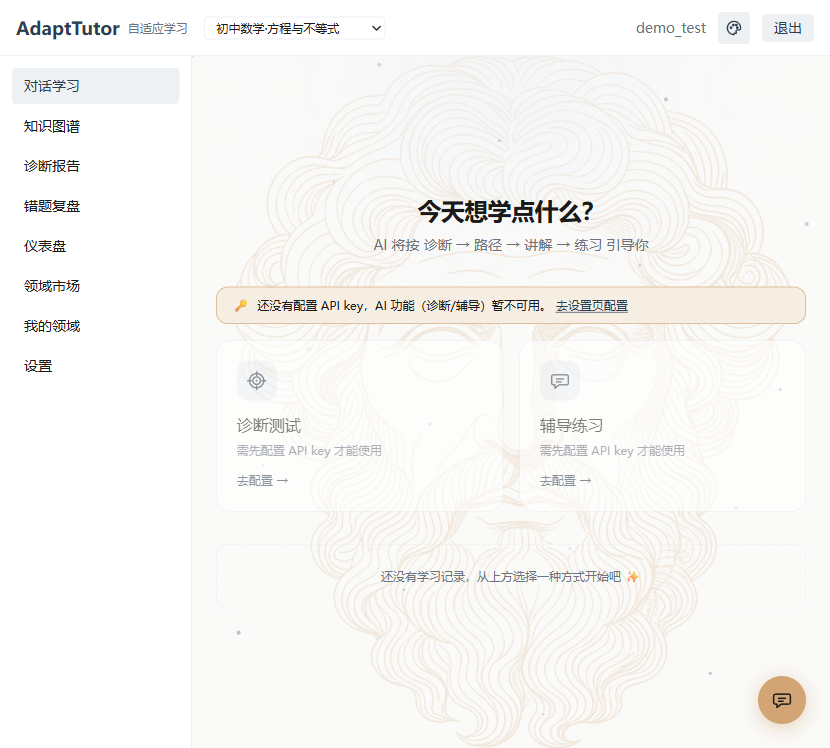
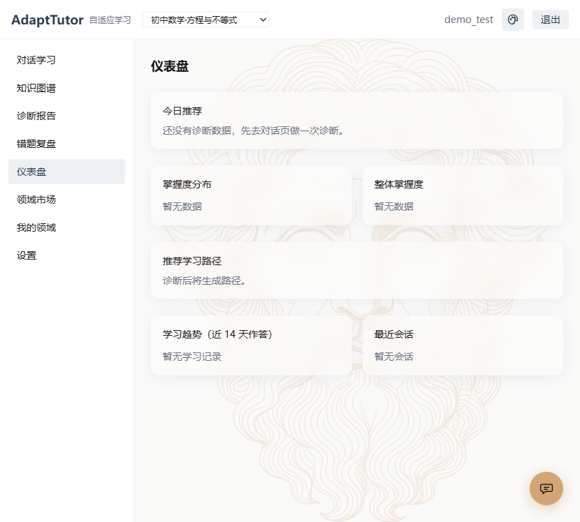
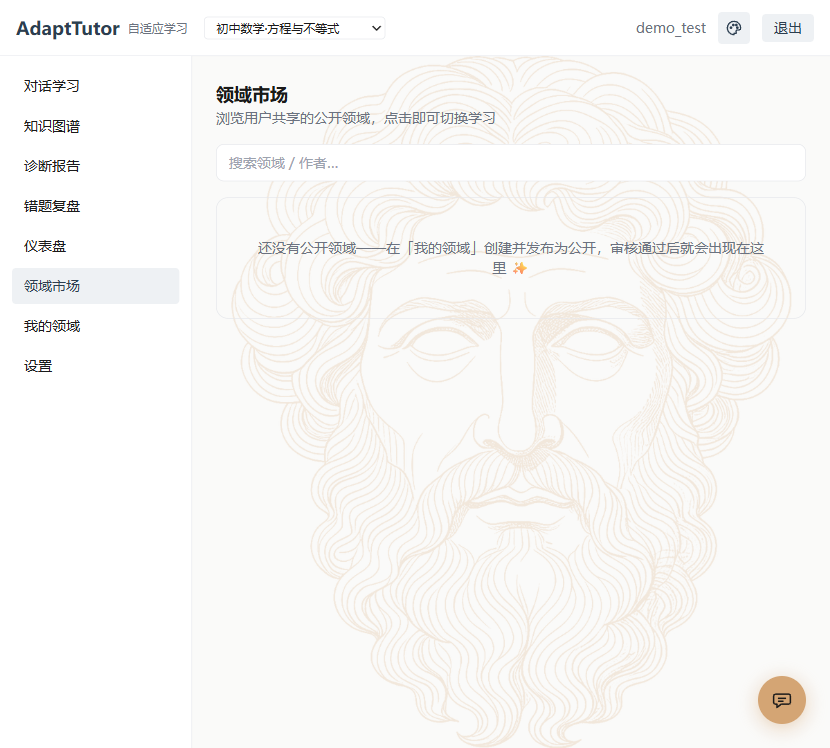
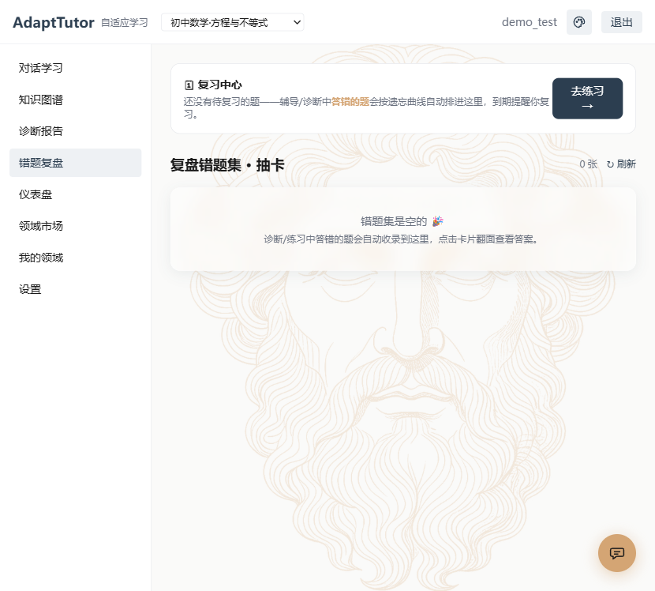
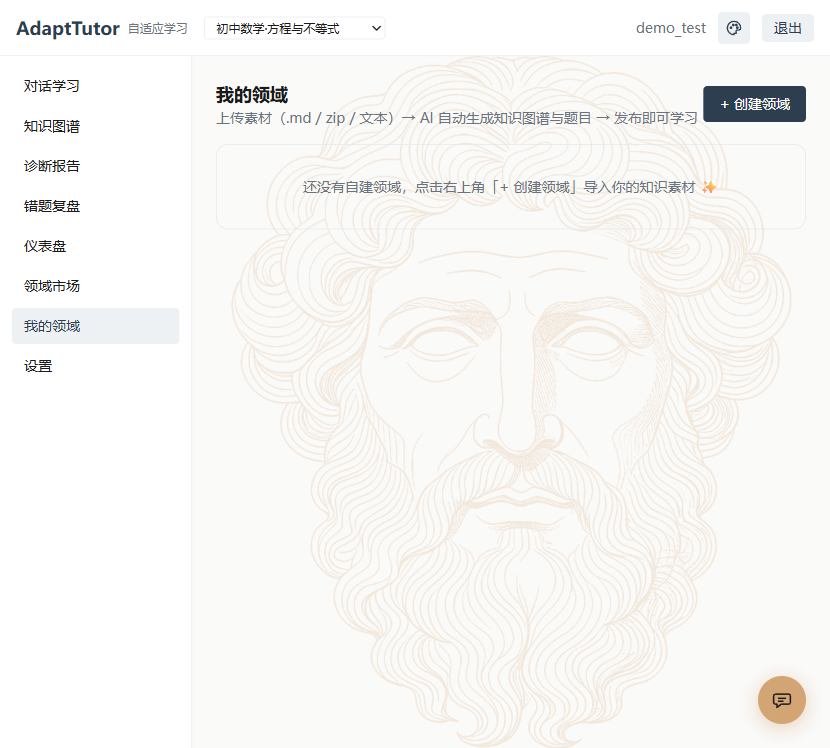
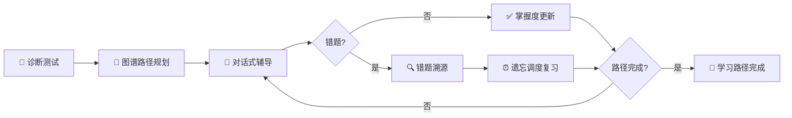
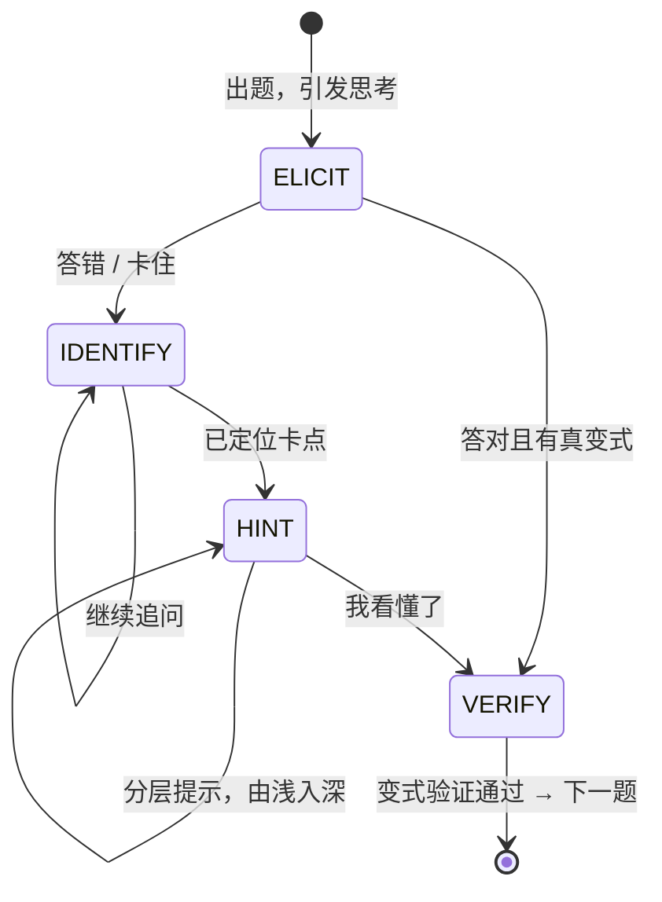
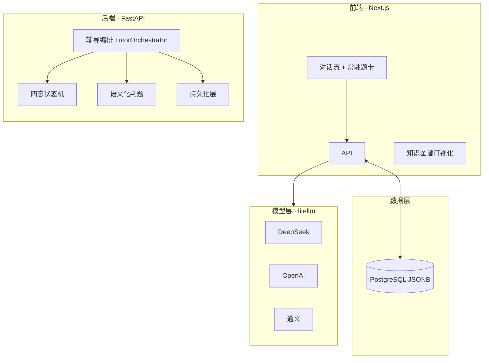

<div align="center">


# AdaptTutor

**通用自适应学习引擎 · 领域无关 · 苏格拉底式引导**

> "干净、安静，没有多余的元素；但有一束温暖的光，照在你正在思考的问题上。"
>
> —— 设计理念 · *a room for thinking*

[](https://nextjs.org/)
[](https://fastapi.tiangolo.com/)
[](https://www.typescriptlang.org/)
[](https://www.python.org/)
[](https://www.postgresql.org/)
[](https://www.docker.com/)
[](https://github.com/BerriAI/litellm)

**学习闭环：诊断 → 路径规划 → 对话式辅导 → 错题溯源 → 遗忘调度复习**

</div>

---

## 📸 页面展示

> 截图取自本地开发环境（墨蓝/琥珀双主题，暗色模式）

| 知识图谱 | 对话式辅导 | 仪表盘 |
| :--: | :--: | :--: |
|  |  |  |

| 领域市场 | 错题复习中心 | 我的领域（AI 生成 / 编辑器） |
| :--: | :--: | :--: |
|  |  |  |

---

## ✨ 它是什么

一个**领域无关**的自适应学习引擎。学科内容以「领域包」接入，引擎本身不绑定任何学科——今天可以是初中数学，明天可以是 LLM 应用开发。

它**不是**一个聊天机器人，而是一套完整的、可真实长期使用的学习系统：

- **不直接给答案**：苏格拉底式状态机引导你亲口说出解法
- **数据不丢**：会话、掌握度、错题全程持久化，随时恢复
- **效果可验证**：每个知识节点都有量化掌握度，学习路径清晰可回溯
- **出问题可修**：领域包是纯配置，改题不改引擎

---

## 🗣️ 交互形态：对话流

辅导页采用**左对话流 + 右常驻题卡**的双栏布局。

### 左栏 · 对话流

每一轮都追加到消息流里，自动滚动到最新一条：

| 角色 | 内容 |
| :-- | :-- |
| **ai** | 开场白、出题、追问、分层提示、判词 |
| **me** | 你的作答 |
| — | 追问竖线：标记这条引导语需要认真对待（主强调色） |

左侧还有一道**台阶刻度**，用横线标记追问的递进层级——竖线只属于「追问」，刻度不与之混用。

### 右栏 · 常驻题卡

当前题**始终可见**，不随对话滚走，作为随时可回看的参照：

- 题干与选项
- 当前知识节点与掌握度
- **答案闸门**：题未终结时锁着，正确答案**不出现在 DOM 里**；只有题被判定结束才解锁展示

### 底部 · 作答区

常驻底部，按题型切换控件（单选 / 多选 / 填空 / 解答）：

- **草稿态**：输入不提交、不判分，用来先把思路写出来
- **💡 求助**：题未终结时可用，给出「最接近的那一步」，而不是直接给答案
- 提交按钮的启用条件是「已选选项 / 已填内容」，未满足时给出明确提示

### 单一判定规则

整个交互只有一个判据：**服务端是否下发了待答题**。

- 下发了新题 → 题卡可作答、闸门重新锁上
- 没下发新题 → 本轮结束，闸门解锁展示结果

这条规则取代了此前「答题卡片是否已翻转 / 索引是否到末尾」等多处派生判断——后者是死锁的根源。

---

## 🎯 核心能力

| | 能力 | 说明 |
| :--: | :-- | :-- |
| 🗺️ | **知识图谱路径规划** | 章节级图谱 + 应用层图算法，从薄弱点自动生成个性化学习路径 |
| 💬 | **对话式引导** | 追问、提示、判词全部进消息流；题卡常驻可回看，草稿态支持先写再答 |
| 🔀 | **四态引导状态机** | ELICIT → IDENTIFY → HINT → VERIFY，每一步都经状态机裁决，杜绝「直接给答案」 |
| ✅ | **语义化判题** | 规则层双向包含 + LLM 语义等价判断——「x=2」与「2」、省略铺垫只答结论，都算对 |
| 🔁 | **错题复习队列** | 答错自动进队，随机间隔重新出现；本轮结束提示「还有 N 道错题未巩固」 |
| 📦 | **领域包机制** | 学科内容 = 图谱 + 题目 + 诊断规则，一个文件夹即一个学科 |

---

## 🔄 学习闭环


```mermaid
flowchart LR
    A["📝 诊断测试"] --> B["🧭 图谱路径规划"]
    B --> C["💬 对话式辅导"]
    C --> D{"错题?"}
    D -->|是| E["🔍 错题溯源"]
    D -->|否| F["✅ 掌握度更新"]
    E --> G["⏰ 遗忘调度复习"]
    F --> H{"路径完成?"}
    G --> H
    H -->|否| C
    H -->|是| I["🏁 学习路径完成"]
```

## 🧭 辅导状态机

每一道题都走一条**确定性、可测试、可回滚**的引导路径：


```mermaid
stateDiagram-v2
    [*] --> ELICIT: 出题，引发思考
    ELICIT --> IDENTIFY: 答错 / 卡住
    ELICIT --> VERIFY: 答对且有真变式
    IDENTIFY --> HINT: 已定位卡点
    IDENTIFY --> IDENTIFY: 继续追问
    HINT --> HINT: 分层提示，由浅入深
    HINT --> VERIFY: 我看懂了
    VERIFY --> [*]: 变式验证通过 → 下一题
```

> **伪变式永远不会出现**：变式题整题重算并独立校验（答案值必须等于题干真值、选项无重复值），
> 解不出真值就拒发——宁可不出变式，也不出无解题。
> 无可机械重算的题目（概念题、解答题、方程应用题）答对即通过，不进入 VERIFY。

---

## 🛠️ 技术栈

| 层 | 选型 | 一句话理由 |
| :-- | :-- | :-- |
| 前端 | **Next.js 14 · TypeScript · TailwindCSS** | 对话流 + 双主题（墨蓝 / 琥珀），`@xyflow/react` 渲染知识图谱 |
| 后端 | **FastAPI · SQLAlchemy(async) · Alembic** | 单机无分布式诉求，后台任务队列即可承载 |
| 存储 | **PostgreSQL JSONB** | 章节级图谱无需图数据库，JSONB 存图 + 应用层图算法 |
| 模型 | **litellm 多模型路由** | 一次接入 DeepSeek / OpenAI / 通义……按任务分层路由，降级可控 |
| 部署 | **Docker Compose 一键部署** | `./scripts/deploy.sh` 一条命令：装 Docker → 密钥 → 构建 → 起栈 → 健康检查；含 Portainer / Uptime Kuma 监控面板 |

> **关键取舍**：弃 Neo4j（JVM 常驻 3-5GB）、弃 Qdrant（数百题规模标签过滤足矣）、
> 弃 Celery + Redis（无分布式诉求）、弃 LangGraph（自研状态机更可控）。
> 详见 [docs/01-技术栈选型对比.md](docs/01-技术栈选型对比.md)。

---

## 🚀 快速开始

### 生产部署（云服务器，一条命令）

```bash
git clone https://github.com/echo804/AdaptTutor.git && cd AdaptTutor
./scripts/deploy.sh <服务器IP>     # 装 Docker → 生成密钥 → 构建 → 起五服务 → 健康检查
```

部署后访问：

| 服务 | 地址 |
| :-- | :-- |
| 前端 | `http://<IP>:3000` |
| 后端 | `http://<IP>:8010/healthz` |
| 监控面板 | `:3001`（Uptime Kuma）/ `:9443`（Portainer） |

详见 [部署指南](docs/部署.md)。

### 本地开发

```bash
# 1. 克隆
git clone https://github.com/echo804/AdaptTutor.git && cd AdaptTutor

# 2. 一键启动开发栈（Docker Compose：Postgres + API + Web）
docker compose -f docker-compose.local.yml up -d

# 3. 打开浏览器
#    前端  http://localhost:3000
#    后端  http://localhost:8010/docs
```

开发模式（热更新）：

```bash
./dev.ps1
```

> ⚠️ **改动前端后若行为可疑，先重启 dev server。** Next.js 的 Fast Refresh 缓存
> 在大改动后可能仍返回旧产物，表现为「代码明明改了但页面没变」。

配置好模型密钥后即可开始第一次学习：

**注册账号** → **选择领域包** → **诊断测试** → **进入对话式辅导**

---

## 📦 内置领域包

| 领域包 | 说明 | 规模 |
| :-- | :-- | :-- |
| `junior_math_eq_ineq` | 初中数学 · 方程与不等式 | 多题型 · 参数化变式 |
| `college_english` | 大学英语 · 四六级 → 考研（词汇 / 翻译） | 236 题 · 难度分档 |
| `llm_app_dev` | LLM 应用开发工程课（RAG / Agent / 微调 / 推理） | 171 题 · 四档难度 |
| `ud*` | 用户上传领域示例（AI 生成 → 审阅 → 入库全流程） | 自定义 |

> **想学什么就接入什么**：一个 `knowledge_graph.json` + 一个 `questions.json`
> + 诊断规则，就是一个新学科。支持 AI 批量生成后人工审阅。

---

## 📐 架构总览


```mermaid
flowchart TB
    subgraph Web["前端 · Next.js"]
        UI["对话流 + 常驻题卡"] --> API
        GRAPH["知识图谱可视化"]
    end
    subgraph BE["后端 · FastAPI"]
        direction TB
        ORCH["辅导编排 TutorOrchestrator"] --> SM["四态状态机"]
        ORCH --> EVAL["语义化判题"]
        ORCH --> REPO["持久化层"]
    end
    subgraph DATA["数据层"]
        PG[("PostgreSQL JSONB")]
    end
    subgraph LLM["模型层 · litellm"]
        DS[DeepSeek]
        OAI[OpenAI]
        QW[通义]
    end
    API --> PG
    API --> LLM
    Web --> API
```

会话与掌握度持久化在 PostgreSQL，**关掉浏览器再回来能接着上次继续**——恢复走
`GET /sessions/{id}/messages` 重建对话流，不是重建卡片栈。

---

## 📚 文档

| 文档 | 内容 |
| :-- | :-- |
| [00-环境搭建](docs/00-环境搭建.md) | 本机实测基线 · 配置与密钥管理 |
| [01-技术栈选型对比](docs/01-技术栈选型对比.md) | 8 项核心选型的对比与弃用理由 |
| [02-项目计划](docs/02-项目计划.md) | 范围分层 · 里程碑 · 量化硬指标 |
| [03-项目架构](docs/03-项目架构.md) | 系统架构 · 引擎与领域包边界 · API 设计 |
| [04-需求决策记录](docs/04-需求决策记录.md) | 登录 / 题型 / 降级 / 产品形态等全部决策 |
| [05-UI设计规范](docs/05-UI设计规范.md) | 「思考的房间」· 配色 / 字体 / 动效 / 情感化细节 |
| [08-改动清单](docs/08-改动清单.md) | 遗留问题清单与逐处改动方案 |
| [部署指南](docs/部署.md) | 服务器部署 · 密钥 · 备份恢复 · 监控面板 · 迁移 |
| [ADR-001\~006](docs/) | 状态机选型 · 图谱存储 · 模型分层路由 · 评估层 · 回滚策略 · 领域包接口 |

---

## 🎨 设计哲学

> **色彩的唯一作用是指引注意力**——只有当前追问、正在查看的知识节点、需要你点击的交互元素，
> 才使用强调色；其余一切保持中性。
>
> **动效只用于两种目的**——引导注意力，或解释信息变化；任何纯装饰性动效都是多余的。
>
> **界面为「长时间思考」服务**——字号、行高、对比度按护眼标准设计，不讨好眼球。

界面是一间安静的、有光的思考室——**墨蓝**是沉静，**琥珀**是那束照在问题上的光。

---

## 📄 License

MIT © 2026 AdaptTutor